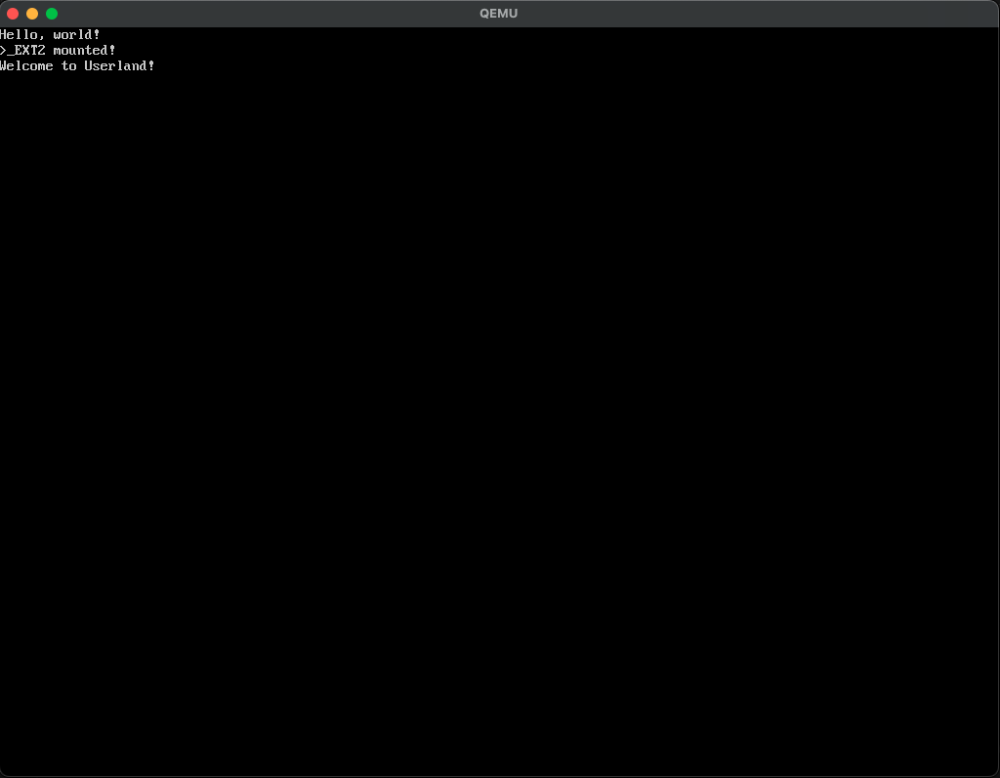

# LabOS-Agarta2

An operating system designed to combine **Linux-like simplicity and freedom** with **macOS-style security** — currently targeting BIOS, with UEFI support planned.


---

## Overview

LabOS Agarta is a hobby OS project that includes:

- Custom bootloader and boot filesystem  
- 32-bit kernel with memory management, virtual memory, and paging  
- VESA framebuffer terminal and basic graphics support  
- Userspace loader for `Mach4` binaries  
- Modular architecture for eventual 64-bit and ARM support  

Future plans include:

- Full UEFI bootloader  
- Mach4 executable format support  
- GUI frameworks: **SpeedUI** and **IsoGL**  
- PlutoniumC compiler and standard libraries (C/C++)  
- Language runtimes: Python, Lua, and possibly Rust  

---

## Building & Running

### Build Kernel
```bash
bash scripts/toolchain.sh
make
make run
```
TIP: Use ```make clean``` to clean any leftovers!

### Running
Pretty simple really, the run targets are defined in the root [Makefile](Makefile)
```bash
make run
```  

If it built successfully, you should see something like this  


## License

LabOS Agarta is licensed under the **Apache 2.0 License**. See [LICENSE](LICENSE) for full details.


## Thanks
Thanks for downloading and contributing to LabOS Agarta!  
EnginePAT (Developer)
